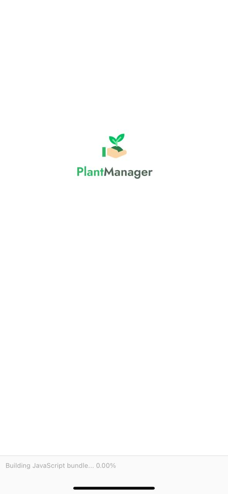
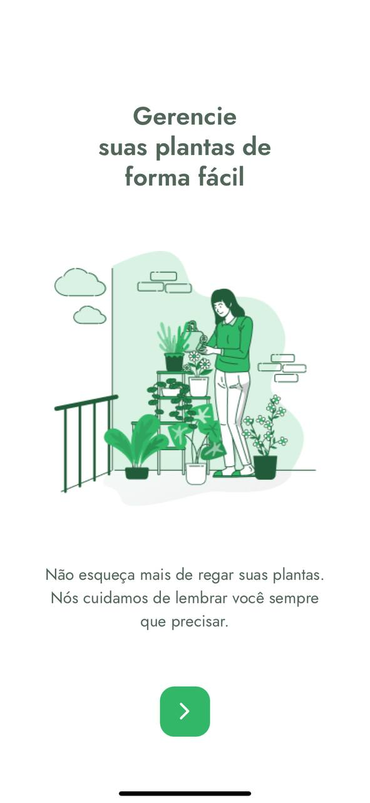
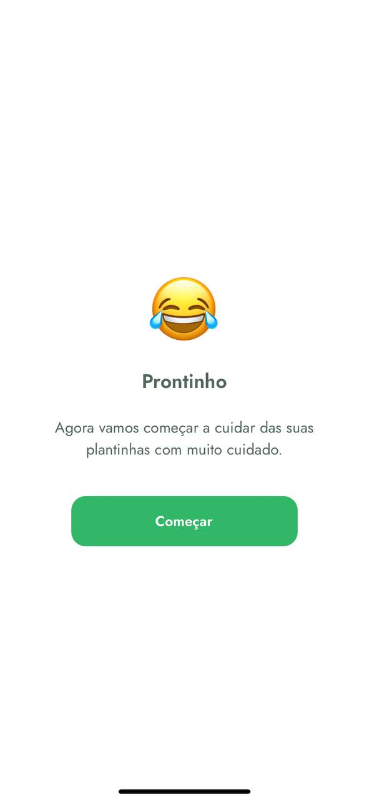
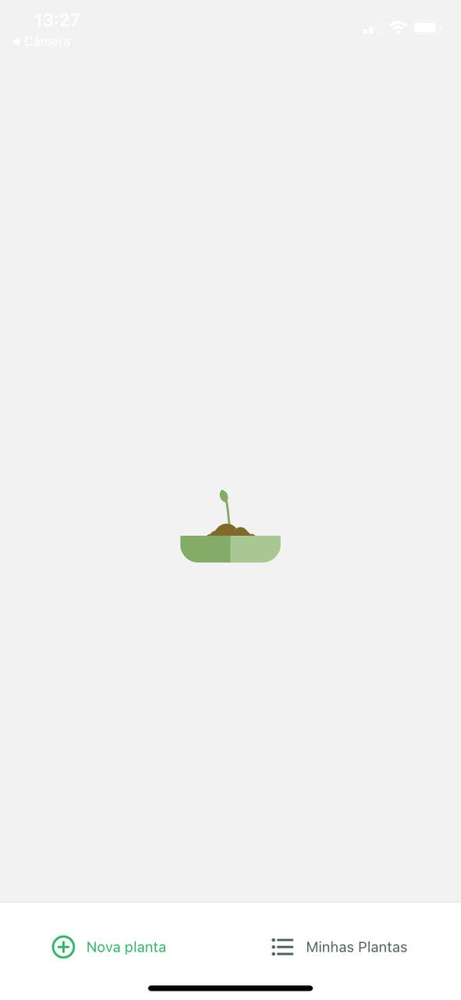
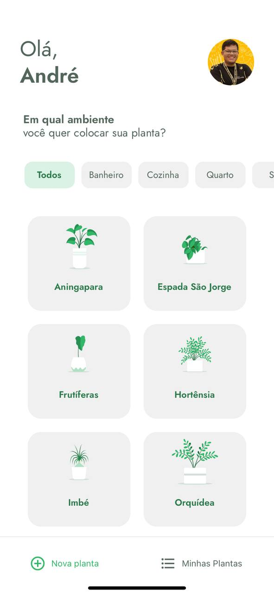
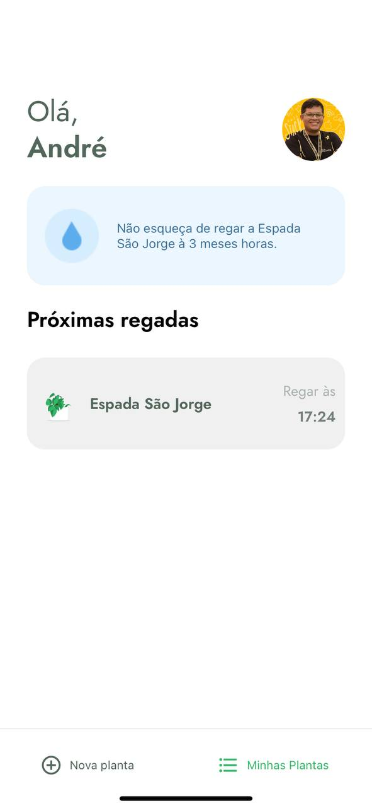
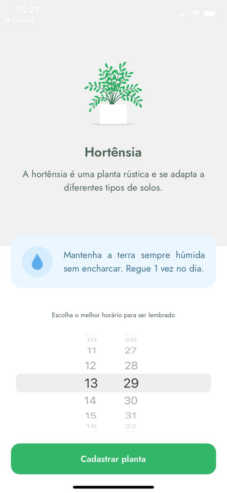

# plantmanager
Aplicativo desenvolvido durante a Next Level Week - 5 proporcionado pela Rocketseat. Esse projeto foi desenvolvido com React Native com auxilio da ferramenta Expo. 

## Aplicativo

